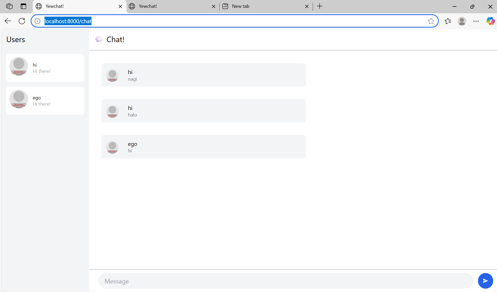
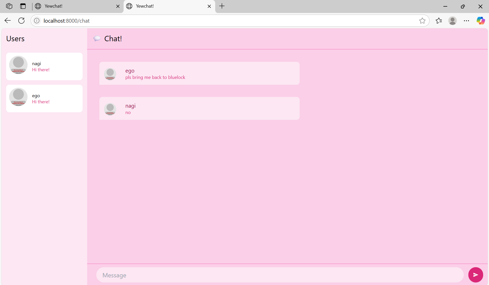

# YewChat 💬

> Source code for [Let’s Build a Websocket Chat Project With Rust and Yew 0.19 🦀](https://fsjohnny.medium.com/lets-build-a-websockets-project-with-rust-and-yew-0-19-60720367399f)

## Install

1. Install the required toolchain dependencies:
   ```npm i```

2. Follow the YewChat post!

## Branches

This repository is divided to branches that correspond to the blog post sections:

* main - The starter code.
* routing - The code at the end of the Routing section.
* components-part1 - The code at the end of the Components-Phase 1 section.
* websockets - The code at the end of the Hello Websockets! section.
* components-part2 - The code at the end of the Components-Phase 2 section.
* websockets-part2 - The code at the end of the WebSockets-Phase 2 section.

## 3.1. Original code


## 3.2. Add some creativities to the webclient

I replaced the gray backgrounds and borders with hot pink Tailwind classes (bg-pink-100, bg-pink-200, border-pink-300). Usernames and message text now use darker pink tints (text-pink-600 and text-pink-800), and the input field plus send button got pink backgrounds and focus styles.